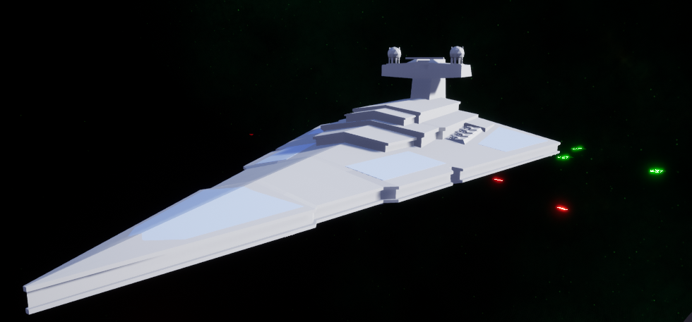
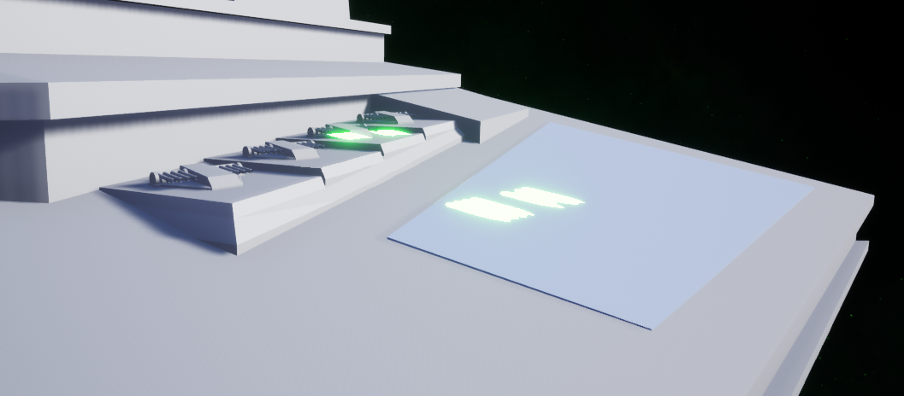
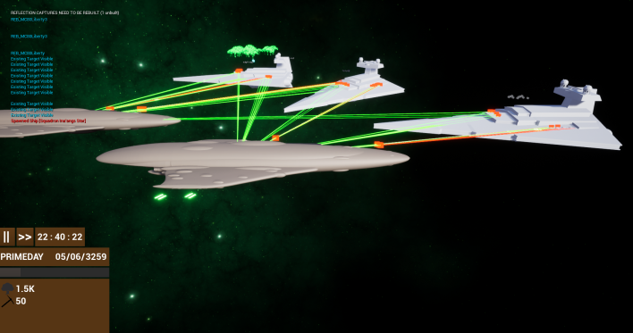
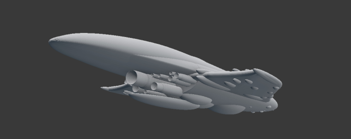

# Empire At War Strikes Back
### A fan remake of the classic 2006 strategy game in a galaxy far far away!
*This project has been solely produced and maintained by @SirChopwood.*

## Description
I planned for this to originally be a test bed for some modelling work i was doing. This quickly elevated to being the beginning of a new game. I hope i can do the fans proud as i recreate the infamous Space Skermish battles of the late *LucasArt's STAR WARS: Empire At War*.

## Contributions
For anyone who wishes to assist me in this project, please contact me on Discord `Illya [Louis]#5376` or through my Website `louismayes2001.weebly.com`.

## To Do:
### Imperial
#### Capital Ships
- [X] Imperial I-Class Star Destroyer
#### Frigates and Corvettes
- [ ] Tartan Cruiser
#### Fighters
- [ ] TIE Fighters
- [ ] TIE Bombers
### Rebellion
- [X] Mon Calamari MC80 Liberty Class Star Cruiser
#### Frigates and Corvettes
- [ ] Quasar
- [ ] Corellian Corvette
#### Fighters
- [ ] T65 X-Wings
- [ ] Y-Wings

